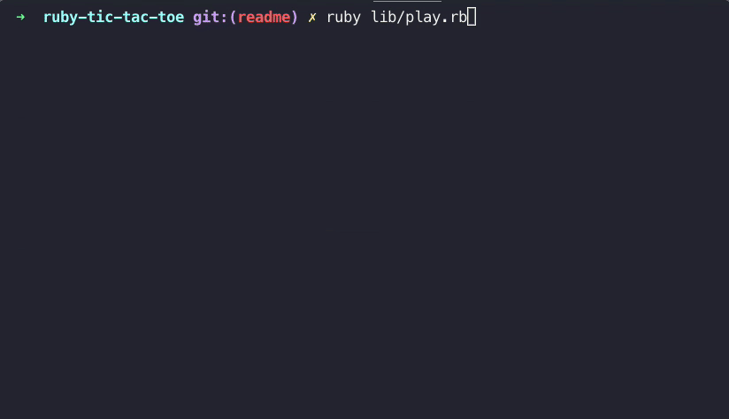

# Ruby Tic Tac Toe

 ### Description

 A Ruby application, which allows the user to play Tic Tac Toe on the command line.

 ### Preview

 

 ### Features
 - Play a new game, or load a saved game
 - Choose to play the following games:
    - Human vs Human
    - Human vs Computer
    - Computer vs Computer
    - Computer vs Human
- The computer player is unbeatable
- When a game has finished, opt to play another game or exit
- Save during the game
- Exit during the game

 ### Getting Started

 Note: if Ruby is not already installed, you can find instructions [here](https://www.ruby-lang.org/en/documentation/installation/).

 ```
git clone https://github.com/itsellej/ruby-tic-tac-toe
cd ruby-tic-tac-toe
bundle install
ruby lib/play.rb
 ```

 ### Language

 The language used to create this application is [Ruby](https://www.ruby-lang.org/en/).

 ### Testing

 The testing library used is [RSpec](https://rspec.info/). To run the tests, type `rspec` in the terminal.

### Edge Cases Considered
- Cases where the user is prompted to enter input again:
  - Game type selection: if `new` or `existing` is not entered
  - Loading a saved game: if the game name entered does not exist
  - Player type selection: if `h` or `c` is not entered
  - Move selection: if 1-9, `'save'` or `'exit'` is not entered during game play
- If the file containing the saved games is empty, a new game is automatically selected 

### Related Blog Posts

- [Tic Tac Toe and The Single Responsibility Principle](https://medium.com/@ellehallal/tic-tac-toe-and-the-single-responsibility-principle-ea5a1d99f5ca?source=---------5------------------)
- [Understanding the Red, Green, Refactor Cycle](https://medium.com/@ellehallal/understanding-the-red-green-refactor-cycle-6495f995874d?source=---------4------------------)
- [Testing Output in RSpec using StringIO](https://medium.com/@ellehallal/testing-output-in-rspec-using-stringio-c784c08acb77?source=---------3------------------)
- [Creating An Unbeatable Computer Player, Using Minimax](https://medium.com/@ellehallal/tic-tac-toe-creating-an-unbeatable-computer-player-using-minimax-f1f1e2f875a2?source=---------2------------------)